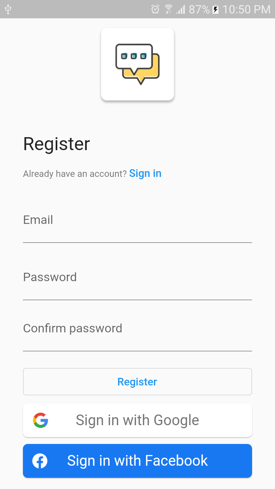
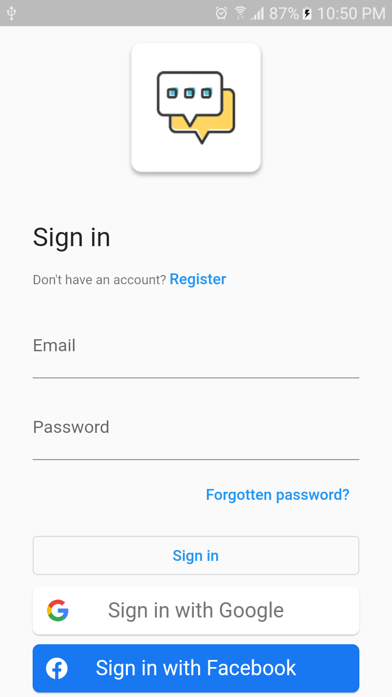
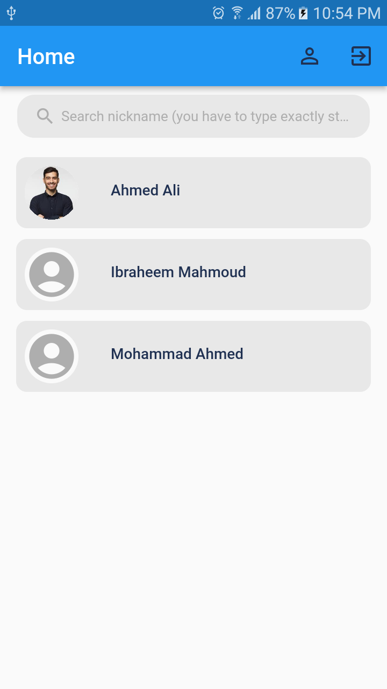
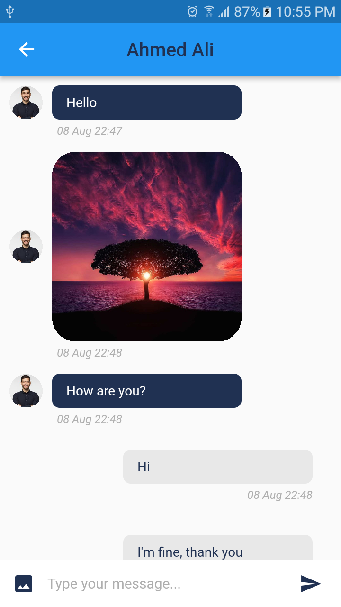
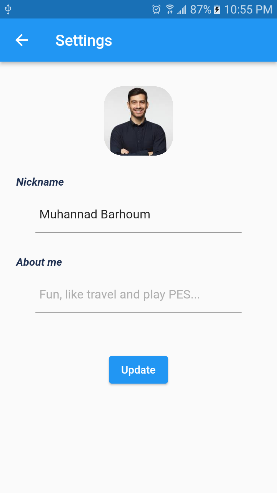

# Messenger

A Flutter project for chatting.

## Features

- Beautiful minimal UI
- Create Account with Email, Google or Facebook
- Login with Email, Google or Facebook
- Reset Password
- Send Text Messages
- Send Photos
- Set nickname, profile image and about me

## Screenshots

<table>

  <tr> 
    <td>   </td>
    <td>    </td>
  </tr>
  <tr> 
    <td>   </td>
    <td>    </td>
  </tr>
  <tr> 
    <td>    </td>
  </tr>

</table>